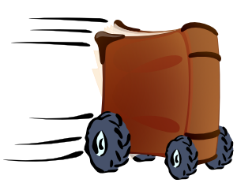

# Thesaurus Engine

<p align="center">
	
</p>

This is my attempt at a 'synonymiser'. It is stochastic, nonsensical synonym replacement program — or a ***loco lexical locomotive***, as it once called itself.

---

## Overview

A synonym engine, powered by [WordNet](https://wordnet.princeton.edu/), which reads a free text input and gives it a seemingly 1700's, aristocratic vernacular.

<p><br></p>

### Setup
To try out my strange thesaurus — assuming [python](https://www.python.org/downloads/) is already installed — just download `ThesaurusEngine.py`, then run each of the dependency download commands in your command prompt. Now, just double-click `ThesaurusEngine.py`.  
Optionally, you can also download `input.txt` for more robust text inputs.  


<p><br></p>

### Dependencies
You will need to run the following commands as part of the installation:
- `pip install nltk`
- `pip install numpy`
- `pip install lemminflect`


<p><br></p>

### Interface
Once double-clicked, `ThesaurusEngine.py` will prompt you for either a direct input or for the instruction to read from the `input.txt` file.  
The following are 2 example outputs, where the first is fed directly from the console and the second reads from `input.txt`:
1.	```
	Enter text below so I can synonymise it, or enter "file" (no quotes) to read from `input.txt`:
	'Better to remain silent and be thought a fool than to speak and remove all doubt' -- Mark Twain.

	ORIGINAL:
	'Better to remain silent and be thought a fool than to speak and remove all doubt' -- Mark Twain.


	FINAL:
	'Better to persist silent and be celebrated a chump than to talk and polish off all doubtfulness' -- Mark Twain.


	Press enter to exit.
	```

2.	```
	Enter text below so I can synonymise it, or enter "file" (no quotes) to read from `input.txt`:
	file

	ORIGINAL:
	It was a bright cold day in April, and the clocks were striking thirteen. Winston Smith, his chin nuzzled into his breast in an effort to escape the vile wind, slipped quickly through the glass doors of Victory Mansions, though not quickly enough to prevent a swirl of gritty dust from entering along with him.


	FINAL:
	It was an undimmed cold twenty-four hour period in April, and the clocks struck baker's dozen. Winston Smith, his mentum nestled into his titty in a movement to get out the vile air current, luxated promptly through the glass threshold of Victory Mansions, though none promptly enough to preclude a whirl of grainy debris from enrolling on with him.


	Press enter to exit.
	```


<p><br></p>

### Disclaimer
- This is a _nonsensical_ NLP tool, so it may not conserve the precise meanings and connotations of each word/phrase.
- This is a _stochastic_ program, meaning you're unlikely to get the same results twice.  
- Spelling and punctuation must be entered correctly.
- My best efforts to package this into an executable were in vain. I tried many methods, but `lemminflect` seems to conflict with them all.

---

## License

Everything here is [unlincensed](LICENSE).
